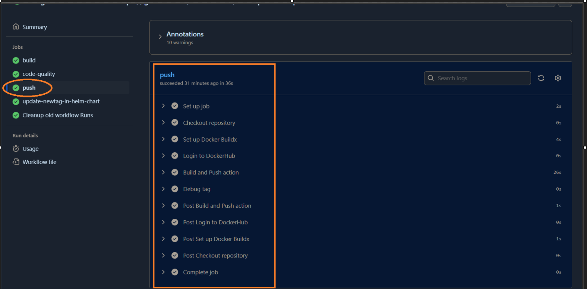
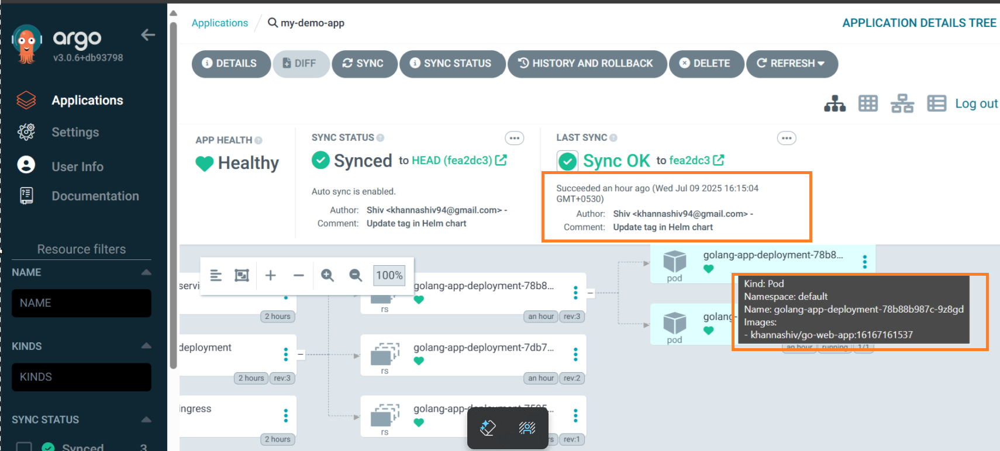

## GitHub Actions Workflows

This directory contains GitHub Actions workflows for the DevOpsified project. These workflows automate various tasks such as building, testing, and deploying the application.

### Workflow Files

- **`demo-cicd.yaml`**: This is the main workflow file that defines the CI/CD pipeline for the project. It includes steps for building the Docker image, pushing it to a registry, updating Kubernetes manifests, and deploying the application.
- **`update-newtag-in-helm-chart.yaml`**: This workflow updates the Helm chart with the new image tag after a successful build. It ensures that the Helm chart is always up-to-date with the latest image version.
- **`update-k8s.yaml`**: This workflow updates the Kubernetes manifests with the new image tag after a successful build. It ensures that the Kubernetes manifests are always up-to-date with the latest image version. 

### Usage
To use these workflows, you need to have a GitHub repository set up with the necessary secrets
configured. The workflows will automatically trigger on specific events such as pushes to the main branch or pull requests.

### Secrets Required
- **`DOCKER_USERNAME`**: Your Docker Hub username for pushing images.
- **`DOCKER_PASSWORD`**: Your Docker Hub password for pushing images.
- **`GITHUB_TOKEN`**: A GitHub token with permissions to push changes to the repository.

### Notes
- Ensure that the Kubernetes cluster is accessible and the necessary permissions are granted for deploying applications.
- The workflows are designed to be modular and can be customized based on your project's requirements. 

### References
- [GitHub Actions Documentation](https://docs.github.com/en/actions): Official documentation for GitHub Actions, providing guides and references for creating and managing workflows.
- [Helm Documentation](https://helm.sh/docs/): Comprehensive documentation for Helm, the Kubernetes package manager, including usage, charts, and best practices.
- [Kubernetes Documentation](https://kubernetes.io/docs/home/): The main documentation hub for Kubernetes, covering concepts, setup, and API references.
- [Docker Documentation](https://docs.docker.com/): Official Docker documentation, including guides on building, sharing, and running containers.
- [Ingress NGINX Controller](https://kubernetes.github.io/ingress-nginx/): Documentation for the NGINX Ingress Controller, which manages external access to services in a Kubernetes cluster.
- [Setting up Local Domain on Windows](https://medium.com/@minhaz1217/setting-up-local-domain-on-windows-8cae2f5c018d): A tutorial on configuring custom local domains on Windows for development purposes.
- [Go Documentation](https://go.dev/doc/): Official documentation for the Go programming language, including guides, references, and tutorials.
- [Go Command Documentation](https://go.dev/doc/cmd): Documentation for Go command-line tools and commands.

### Additional Resources
- [DevOpsified Project Repository for practice](https://github.com/iam-veeramalla/go-web-app): The main repository for the Go web application used in this project.
- [DevOpsified Project DevOps Repository](https://github.com/iam-veeramalla/go-web-app-devops): Repository containing DevOps resources and configurations for the project.
- [Ingress Controller Name for the Ingress Class](https://stackoverflow.com/questions/64781320/ingress-controller-name-for-the-ingress-class): Stack Overflow discussion on specifying the correct ingress controller name in Kubernetes manifests.
- [Kubernetes Ingress NGINX Deployment](https://kubernetes.github.io/ingress-nginx/deploy/): Official deployment guide for setting up the NGINX Ingress Controller in Kubernetes.
- [AWS Provider NGINX Ingress Deployment YAML](https://raw.githubusercontent.com/kubernetes/ingress-nginx/controller-v1.13.0/deploy/static/provider/aws/deploy.yaml): Raw YAML manifest for deploying the NGINX Ingress Controller on AWS.
- [What does := mean in Go?](https://stackoverflow.com/questions/42691705/what-does-mean-in-go): Stack Overflow explanation of the `:=` short variable declaration syntax in Go.

---

### Outcomes of this hands-on lab
- Successfully set up a CI/CD pipeline using GitHub Actions for a Go web application.
- Automated the process of building, testing, and deploying the application to a Kubernetes cluster.
- Configured Helm charts for managing application deployments in Kubernetes.
- Implemented best practices for versioning and updating application images in a Kubernetes environment.

- 
- 
- 
- 
- 
- 
- 
- 
- 
- 

- 
- 
- 
- 
- 

- 
- 
- 
- 
- 
- 
- 
- 
- 
- 
- 
- 
- 
- 

- 
- 
- 
- 

--- 